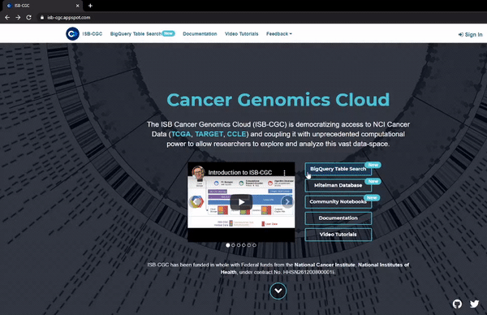
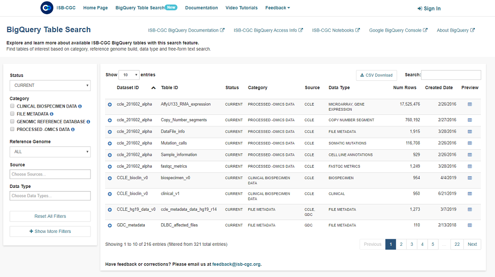

<style type="text/css">
body {
  color: #FFFFFF;
  font: 15px arial;
  background: #002664
}
</style>

<!-- 
Hello, and welcome to an overview of the BigQuery Table Search from the ISB-CGC.
-->

## ISB-CGC BigQuery Table Search

* Allows users to identify and learn more about available ISB-CGC BigQuery tables
* No login required!
* Each table has been curated to include detailed table and field descriptions as well as table labels
* Search for table(s) of interest using a free-form text search or via available filters (including status, reference genome build, data format, category)
* Explore table(s) of interest; learn about the data formats, data types and data sources
* Preview first few ~10 lines of the table of interest

<!-- 
The BigQuery Table Search allows users to explore the available data sets and tables from the ISB-CGC and the Genomic Data Commons. This feature does not require the user to log in. Each table has been curated to include descriptions and tags, to help you find the data you need.
-->

## How to Navigate to BigQuery Table Search

```{r, out.width='600px', out.height='388', echo=FALSE}


```

<!-- 
The BigQuery Table Search can be found on the ISB-CGC homepage by clicking on one of the links.
-->

## ISB-CGC BigQuery Table Search Main Page

```{r, out.width='100%', echo=FALSE}


```

<!--
You are able to find tables of interest based on category, reference genome build, data type and free-form text search.

Let's say, for example, that you wanted to find a specific table type such as the miRNA tables with the label of open within BigQuery but didn't have a project yet and wanted to make sure there were ones available.
-->

## Different filters

```{r, out.width='100%', echo=FALSE}
# Gif with clicking the 'show more filters'

```

<!--
There are several different filters available to sort through the tables available. We will click Show More Filters and then type open into the Labels field.
-->

## Search by Data Type

```{r, out.width='100%', echo=FALSE}
# Gif the MIRNA EXPRESSION data type filled

```

<!--
To add a data type, you can click on the Data Type box to choose a data type from the drop down menu. You can also start typing the data type you would like to filter the list. We are going to select the miRNA Expression data type. The list of tables will only then display the tables that meet our creteria.
-->

## How to find how to sort by create date

```{r, out.width='100%', echo=FALSE}
# Gif with the list sorting to the most recent on top

```

<!--
The list then can be sorted by any of the header rows. Let's sort by create date to find the most recent tables.
-->

## Preview information

```{r, out.width='100%', echo=FALSE}
# Gif with the preview information expanding

```

<!--
To find out more information about the table, click the plus button on the left hand side of the Dataset ID to reveal more information about the table itself such as the table description and feild information. The table ID for use in a query can be created from the ID but with the semicolon replaced with a period.
-->

## Highlight links at the top of the page

```{r, out.width='100%', echo=FALSE}
# Gif with the links at the top of the page highlighted

```

Visit us at isb-cgc.org
Questions or feedback, please email us at feedback@isb-cgc.org.

<!-- Our BigQuery Documentation has more indepth information on our BigQuery Tables along with example notebooks in the Community Notebook Repository. Google offers a free tier for exploring the Google Cloud capabilities though a Google Cloud Project will need to be set up. Visit us at isb-cgc.org and please let know if you have any questions or feedback, we always enjoy hearing from our users.
-->